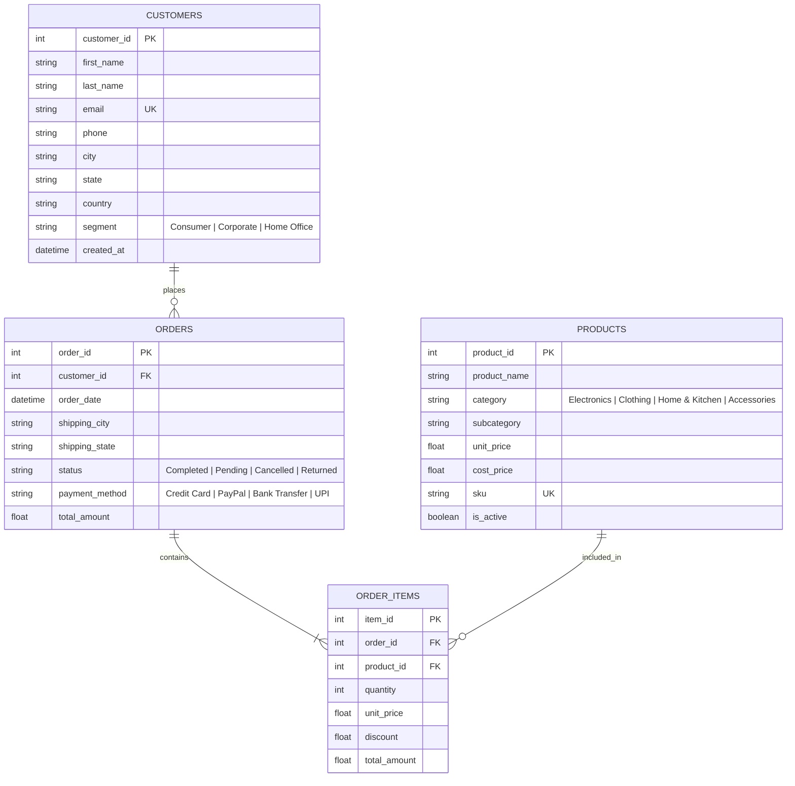

# Database Schema Documentation & Data Dictionary

The AI Sales Analytics Chatbot relies on a relational star/snowflake-adjacent schema optimized for transactional processing (OLTP) and analytical queries (OLAP).

## Entity Relationship (ER) Diagram

---

## Data Dictionary

### 1. `customers` Table
Stores customer demographic and segmentation attributes.
- **`customer_id`** (INT, PK): Auto-incrementing primary key.
- **`first_name`** (VARCHAR(50)): Customer's first name.
- **`last_name`** (VARCHAR(50)): Customer's last name.
- **`email`** (VARCHAR(100), UNIQUE, INDEX): Primary identifier and contact email.
- **`city`** (VARCHAR(50), INDEX): Customer city.
- **`state`** (VARCHAR(50), INDEX): Customer state.
- **`segment`** (VARCHAR(30), INDEX): Business segment classification (`Consumer`, `Corporate`, `Home Office`).

### 2. `products` Table
Master product catalog containing pricing and categorical hierarchies.
- **`product_id`** (INT, PK): Primary key.
- **`product_name`** (VARCHAR(150), INDEX): Product description name.
- **`category`** (VARCHAR(50), INDEX): Major product category (`Electronics`, `Clothing`, `Home & Kitchen`, `Accessories`).
- **`subcategory`** (VARCHAR(50), INDEX): Detailed category grouping.
- **`unit_price`** (FLOAT): Standard retail sales price.
- **`cost_price`** (FLOAT): COGS (Cost of Goods Sold) for margin calculations.
- **`sku`** (VARCHAR(50), UNIQUE): Stock keeping unit.

### 3. `orders` Table
Header table capturing transactional metadata.
- **`order_id`** (INT, PK): Primary key.
- **`customer_id`** (INT, FK -> `customers.customer_id`, INDEX): Customer placement link.
- **`order_date`** (TIMESTAMP, INDEX): Timestamp of order creation.
- **`status`** (VARCHAR(20), INDEX): Order state (`Completed`, `Pending`, `Cancelled`, `Returned`).
- **`payment_method`** (VARCHAR(30)): Payment channel.
- **`total_amount`** (FLOAT): Aggregated order value.

### 4. `order_items` Table
Line item granularity for cart breakdown.
- **`item_id`** (INT, PK): Primary key.
- **`order_id`** (INT, FK -> `orders.order_id`, INDEX): Parent header order link.
- **`product_id`** (INT, FK -> `products.product_id`, INDEX): Product purchased link.
- **`quantity`** (INT): Number of units purchased.
- **`unit_price`** (FLOAT): Historical unit price at purchase time.
- **`discount`** (FLOAT): Percentage discount applied (0.00 to 0.50).
- **`total_amount`** (FLOAT): Line total equal to `(unit_price * (1 - discount)) * quantity`.

---

## Indexing & Performance Strategy
1. **Composite Index `idx_order_date_status`**: Speeds up time-series filtering on completed orders (`WHERE status = 'Completed' AND order_date >= ...`).
2. **Foreign Key Indexes**: Placed on `orders.customer_id`, `order_items.order_id`, and `order_items.product_id` to eliminate full table scans during `JOIN` operations.
3. **Categorical Indexes**: Placed on `products.category`, `customers.segment`, and `orders.shipping_state` for fast grouping aggregations.
